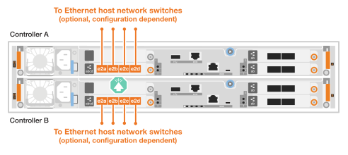
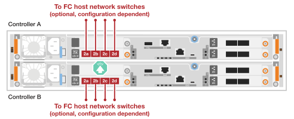

= Conecta el hardware para el sistema de almacenamiento ASA C30
:allow-uri-read: 
:icons: font
:imagesdir: ../media/

[role="lead"]
Conecta el sistema de almacenamiento ASA C30 a tu red y a los estantes de almacenamiento para habilitar la comunicación del clúster, el acceso de gestión y la conectividad de host SAN. Este procedimiento incluye el cableado para la interconexión de clúster/HA, la red de gestión, la red de host y las conexiones de estantes de almacenamiento.

.Antes de empezar
Póngase en contacto con el administrador de red para obtener información sobre cómo conectar el sistema de almacenamiento a los switches de red.

.Acerca de esta tarea
* Estos procedimientos muestran configuraciones comunes. El cableado específico depende de los componentes solicitados del sistema de almacenamiento. Para obtener información completa sobre la configuración y la prioridad de las ranuras, consulte link:https://hwu.netapp.com["NetApp Hardware Universe"^].
* Los gráficos de cableado tienen iconos de flecha que muestran la orientación correcta (hacia arriba o hacia abajo) de la lengüeta extraíble del conector de cable al insertar un conector en un puerto.
+
Al insertar el conector, debería sentir que hace clic en su lugar; si no cree que hace clic, quítelo, vuelva a convertirlo y vuelva a intentarlo.

+
image:../media/drw_cable_pull_tab_direction_ieops-1699.svg["Dirección de la lengüeta de tracción del cable"]

* Si el cableado va a un conmutador óptico, inserte el transceptor óptico en el puerto del controlador antes de realizar el cableado en el puerto del switch.

== Paso 1: Conecte los cables de las conexiones del clúster/alta disponibilidad

Cablea los controladores para crear las conexiones del clúster ONTAP. Para clústeres sin switches, conecta los controladores entre sí. Para clústeres con switches, conecta los controladores a los switches de red del clúster.

NOTE: El tráfico de interconexión de clúster y el tráfico de alta disponibilidad comparten los mismos puertos físicos.

[role="tabbed-block"]
====
.Cableado de clúster sin switches
--
Usa esta opción de cableado cuando los dos controladores estén conectados directamente entre sí sin usar switches de red en clúster.

.ASA C30 con dos módulos de E/S de 2 puertos 40/100 GbE
Cablea los puertos de interconexión de alta disponibilidad del clúster en los módulos de E/S de las ranuras 2 y 4.

NOTE: El tráfico de interconexión del clúster y el tráfico de alta disponibilidad comparten los mismos puertos físicos (en los módulos de I/O en las ranuras 2 y 4). Los puertos son 40/100 GbE.

.Pasos
. Conecte la controladora A, el puerto E2A al puerto E2A de la controladora B.
. Conecte la controladora A, el puerto E4A al puerto E4A de la controladora B.
+

NOTE: Los puertos E2B y e4b de los módulos de I/O no se utilizan y están disponibles para la conectividad de red del host.

+
*100 GbE Cluster/cables de interconexión HA*

+
image::../media/oie_cable100_gbe_qsfp28.png[Cable de alta disponibilidad de 100 GbE del clúster]

+
image::../media/drw_isi_a30-50_switchless_2p_100gbe_2card_cabling_ieops-2011.svg[Diagrama de cableado de clúster sin switches con dos módulos de E/S de 100 GbE]

.ASA C30 con un módulo I/O de 40/100 GbE con 2 puertos
Conecta los puertos de interconexión de alta disponibilidad del módulo de E/S en la ranura 4.

NOTE: El tráfico de interconexión del clúster y el tráfico de alta disponibilidad comparten los mismos puertos físicos (en el módulo de I/O de la ranura 4). Los puertos son 40/100 GbE.

.Pasos
. Conecte la controladora A, el puerto E4A al puerto E4A de la controladora B.
. Conecte la controladora A, el puerto e4b al puerto e4b de la controladora B.
+
*100 GbE Cluster/cables de interconexión HA*

+
image::../media/oie_cable100_gbe_qsfp28.png[Cable de alta disponibilidad de 100 GbE del clúster]

+
image::../media/drw_isi_a30-50_switchless_2p_100gbe_1card_cabling_ieops-1925.svg[Diagrama de cableado de clúster sin switches con un módulo de E/S de 100 GbE]

--
.Cableado de clúster conmutado
--
Usa esta opción de cableado cuando los controladores se conectan a switches de red de clúster en vez de estar conectados directamente entre sí.

.ASA C30 con dos módulos de E/S de 2 puertos 40/100 GbE
Conecta los puertos de interconexión de clúster/alta disponibilidad en los módulos de E/S de las ranuras 2 y 4 a los switches de red del clúster.

NOTE: El tráfico de interconexión del clúster y el tráfico de alta disponibilidad comparten los mismos puertos físicos (en los módulos de I/O en las ranuras 2 y 4). Los puertos son 40/100 GbE.

.Pasos
. Conecte el puerto e4a del controlador A al conmutador de red del clúster A.
. Conecte el puerto e2a del controlador A al conmutador de red del clúster B.
. Conecte el puerto e4a del controlador B al conmutador de red del clúster A.
. Conecte el puerto e2a del controlador B al conmutador de red del clúster B.
+

NOTE: Los puertos E2B y e4b de los módulos de I/O no se utilizan y están disponibles para la conectividad de red del host.

+
*40/100 GbE Cluster/cables de interconexión HA*

+
image::../media/oie_cable100_gbe_qsfp28.png[Cable de alta disponibilidad de 40/100 GbE del clúster]

+
image::../media/drw_isi_a30-50_switched_2p_100gbe_2card_cabling_ieops-2013.svg[Diagrama de cableado de clúster conmutado con dos módulos de E/S de 100 GbE]

.ASA C30 con un módulo I/O de 40/100 GbE con 2 puertos
Conecta los puertos de interconexión de clúster/HA del módulo de E/S en la ranura 4 a los switches de red del clúster.

NOTE: El tráfico de interconexión del clúster y el tráfico de alta disponibilidad comparten los mismos puertos físicos (en el módulo de I/O de la ranura 4). Los puertos son 40/100 GbE.

.Pasos
. Conecte el puerto e4a del controlador A al conmutador de red del clúster A.
. Conecte el puerto e4b del controlador A al conmutador de red del clúster B.
. Conecte el puerto e4a del controlador B al conmutador de red del clúster A.
. Conecte el puerto e4b del controlador B al conmutador de red del clúster B.
+
*40/100 GbE Cluster/cables de interconexión HA*

+
image::../media/oie_cable100_gbe_qsfp28.png[Cable de alta disponibilidad de 40/100 GbE del clúster]

+
image::../media/drw_isi_a30-50_2p_100gbe_1card_switched_cabling_ieops-1926.svg[Cablear las conexiones del clúster a la red del clúster]

--
====

== Paso 2: Conecte los cables de las conexiones de red host

Conecte los puertos del módulo Ethernet o los puertos del módulo Fibre Channel (FC) a la red host.

[role="tabbed-block"]
====
.Cableado de host Ethernet
--
Conecta los controladores a tu red host Ethernet usando los puertos adecuados según la configuración de tu módulo de I/O.

.ASA C30 con dos módulos de E/S de 2 puertos 40/100 GbE
En cada controladora, conecte los puertos E2B y e4b a los switches de red host Ethernet.

NOTE: Los puertos en los módulos de I/O de la ranura 2 y 4 son de 40/100 GbE (la conectividad de host es de 40/100 GbE).

* Cables de 40/100 GbE*

image::../media/oie_cable_sfp_gbe_copper.png[cable 40/100 GbE]

image::../media/drw_isi_a30-50_host_2p_40-100gbe_2card_cabling_ieops-2014.svg[Cable a switches de red host Ethernet 40/100 GbE]

.ASA C30 con un módulo I/O de 10/25 GbE con 4 puertos
En cada controlador, conecta los puertos e2a, e2b, e2c y e2d a los switches de red host Ethernet.

* Cables de 10/25 GbE*

image:../media/oie_cable_sfp_gbe_copper.png["Conector de cobre SFP GbE,width=100px"]

--
.Cableado de host FC
--
Conecta los controladores a tu red host de Fibre Channel usando el módulo de E/S FC en tu sistema.

.ASA C30 con un módulo de E/S FC de 4 puertos y 64 Gb/s
En cada controlador, conecta los puertos 2a, 2b, 2c y 2d a los switches de red del host FC.

*64 Gb/s cables FC*

image:../media/oie_cable_sfp_gbe_copper.png["cable FC 64 Gb/s,width=100px"]

--
====

== Paso 3: Conecte los cables de las conexiones de red de gestión

Conecte las controladoras a su red de gestión.

Conecte los puertos de gestión (llave inglesa) de cada controladora a los switches de red de gestión.

* 1000BASE-T CABLES RJ-45*

image::../media/oie_cable_rj45.png[Cables RJ-45]

image::../media/drw_isi_g_wrench_cabling_ieops-1928.svg[Conéctese a su red de gestión]

IMPORTANT: No enchufe los cables de alimentación todavía.

== Paso 4: Conecte los cables de las conexiones de la bandeja

El procedimiento de cableado de la estantería NS224 muestra módulos NSM100B en lugar de módulos NSM100. El cableado es el mismo independientemente del tipo de módulo NSM utilizado; solo varían los nombres de los puertos:

* Los módulos NSM100B utilizan los puertos e1a y e1b en un módulo de E/S en la ranura 1.
* Los módulos NSM100 utilizan puertos integrados (integrados) e0a y e0b.

Para conocer el número máximo de bandejas compatibles con el sistema de almacenamiento y todas las opciones de cableado, como ópticas y conectadas por switch, consulte link:https://hwu.netapp.com["NetApp Hardware Universe"^].

Conecta cada controlador a cada módulo NSM en la bandeja NS224 usando los cables de almacenamiento que vinieron con tu sistema de almacenamiento.

*100 GbE QSFP28 cables de cobre*

image::../media/oie_cable100_gbe_qsfp28.png[Cable de cobre QSFP28 de 100 GbE]

El gráfico muestra el cableado de la controladora A en azul y el cableado de la controladora B en amarillo.

.Pasos
. Conecte el puerto e3a de la controladora A al puerto NSM A e1a.
. Conecte la controladora A al puerto E3b al puerto NSM B e1b.
+
image:../media/drw_isi_g_1_ns224_controller_a_cabling_ieops-1945.svg["La controladora A dispone de los puertos E3A y E3b cableados a una bandeja NS224"]

. Conecte el puerto e3a de la controladora B al puerto NSM B e1a.
. Conecte el puerto e3b de la controladora B al puerto NSM A e1b.
+
image:../media/drw_isi_g_1_ns224_controller_b_cabling_ieops-1946.svg["Controladora B con los puertos E3A y E3b cableados a una bandeja NS224"]

.El futuro
Después de conectar las controladoras de almacenamiento a la red y luego conectar las controladoras a las bandejas de almacenamiento, ustedlink:power-on-hardware.html["Encienda el sistema de almacenamiento R2 de ASA"].
