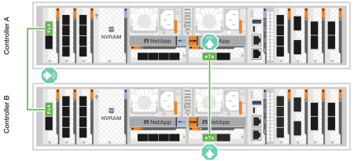
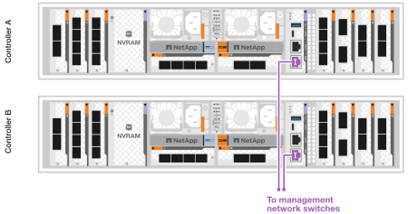

= Conecte el hardware del sistema de almacenamiento ASA R2
:allow-uri-read: 
:icons: font
:imagesdir: ../media/

[role="lead"]
Después de instalar el hardware de rack para el sistema de almacenamiento ASA R2, instale los cables de red para las controladoras y conecte los cables entre las controladoras y las bandejas de almacenamiento.

.Antes de empezar
Póngase en contacto con el administrador de red para obtener información sobre cómo conectar el sistema de almacenamiento a los switches de red.

.Acerca de esta tarea
* Estos procedimientos muestran configuraciones comunes. El cableado específico depende de los componentes solicitados del sistema de almacenamiento. Para obtener información detallada sobre la configuración, consulte link:https://hwu.netapp.com["NetApp Hardware Universe"^].
* Los gráficos de cableado tienen iconos de flecha que muestran la orientación correcta (hacia arriba o hacia abajo) de la lengüeta extraíble del conector de cable al insertar un conector en un puerto.
+
Al insertar el conector, debería sentir que hace clic en su lugar; si no cree que hace clic, quítelo, vuelva a convertirlo y vuelva a intentarlo.

+
image:../media/drw_cable_pull_tab_direction_ieops-1699.svg["Dirección de la lengüeta de tracción del cable"]

* Si el cableado va a un conmutador óptico, inserte el transceptor óptico en el puerto del controlador antes de realizar el cableado en el puerto del switch.

== Paso 1: Conecte los cables de las conexiones del clúster/alta disponibilidad

Conecte los cables de las controladoras al clúster de ONTAP. Este procedimiento varía según el modelo del sistema de almacenamiento y la configuración del módulo de I/O.

NOTE: El tráfico de interconexión de clúster y el tráfico de alta disponibilidad comparten los mismos puertos físicos.

[role="tabbed-block"]
====
.A1K
--
Cree las conexiones del clúster de ONTAP. En el caso de clústeres sin switch, conecte las controladoras entre sí. En el caso de los clústeres con switches, conecte las controladoras a los switches de red de clúster.

.Cableado de clúster sin switches
[%collapsible]
=====
Use el cable de interconexión de clúster/alta disponibilidad para conectar los puertos e1a a e1a y los puertos e7a a e7a.

.Pasos
. Conecte el puerto e1a de la Controladora A al puerto e1a de la Controladora B.
. Conecte el puerto e7a de la Controladora A al puerto e1a de la Controladora B.
+
* Cables de interconexión Cluster/HA*

+
image::../media/oie_cable_25Gb_Ethernet_SFP28_IEOPS-1069.svg[Cable de alta disponibilidad de clúster]

+

=====
.Cableado de clúster conmutado
[%collapsible]
=====
Use el cable de 100 GbE para conectar los puertos e1a a e1a y los puertos e7a a e7a.

NOTE: Las configuraciones de clúster conmutado son compatibles con la versión 9.16.1 y versiones posteriores.

.Pasos
. Conecte el puerto e1a de la Controladora A y el puerto e1a de la Controladora B al switch de red de clúster A.
. Conecte el puerto e7a de la Controladora A y el puerto e7a de la Controladora B al switch de red de clúster B.
+
*Cable de 100 GbE*

+
image::../media/oie_cable100_gbe_qsfp28.png[Cable de 100 GB]

+
image::../media/drw_a1k_switched_cluster_cabling_ieops-1652.svg[Cablear las conexiones del clúster a la red del clúster]

=====
--
.A70 y A90
--
Cree las conexiones del clúster de ONTAP. En el caso de clústeres sin switch, conecte las controladoras entre sí. En el caso de los clústeres con switches, conecte las controladoras a los switches de red de clúster.

.Cableado de clúster sin switches
[%collapsible]
=====
Use el cable de interconexión de clúster/alta disponibilidad para conectar los puertos e1a a e1a y los puertos e7a a e7a.

.Pasos
. Conecte el puerto e1a de la Controladora A al puerto e1a de la Controladora B.
. Conecte el puerto e7a de la Controladora A al puerto e1a de la Controladora B.
+
* Cables de interconexión Cluster/HA*

+
image::../media/oie_cable_25Gb_Ethernet_SFP28_IEOPS-1069.svg[Cable de alta disponibilidad de clúster]

+
image::../media/drw_70-90_tnsc_cluster_cabling_ieops-1653.svg[Diagrama de cableado de clústeres de dos nodos sin switches]

=====
.Cableado de clúster conmutado
[%collapsible]
=====
Use el cable de 100 GbE para conectar los puertos e1a a e1a y los puertos e7a a e7a.

NOTE: Las configuraciones de clúster conmutado son compatibles con la versión 9.16.1 y versiones posteriores.

.Pasos
. Conecte el puerto e1a de la Controladora A y el puerto e1a de la Controladora B al switch de red de clúster A.
. Conecte el puerto e7a de la Controladora A y el puerto e7a de la Controladora B al switch de red de clúster B.
+
*Cable de 100 GbE*

+
image::../media/oie_cable100_gbe_qsfp28.png[Cable de 100 GB]

+
image::../media/drw_70-90_switched_cluster_cabling_ieops-1657.svg[Cablear las conexiones del clúster a la red del clúster]

=====
--
.A20, A30 Y A50
--
Cree las conexiones del clúster de ONTAP. En el caso de clústeres sin switch, conecte las controladoras entre sí. En el caso de los clústeres con switches, conecte las controladoras a los switches de red de clúster.

* Cableado de clúster sin conmutación*

Conecte las controladoras entre sí para crear las conexiones del clúster de ONTAP.

.ASA A30 y ASA A50 con dos módulos de I/O de 40/100 GbE con 2 puertos
[%collapsible]
=====
.Pasos
. Conecte las conexiones de interconexión de clúster/alta disponibilidad:
+

NOTE: El tráfico de interconexión del clúster y el tráfico de alta disponibilidad comparten los mismos puertos físicos (en los módulos de I/O en las ranuras 2 y 4). Los puertos son 40/100 GbE.

+
.. Conecte la controladora A, el puerto E2A al puerto E2A de la controladora B.
.. Conecte la controladora A, el puerto E4A al puerto E4A de la controladora B.
+

NOTE: Los puertos E2B y e4b de los módulos de I/O no se utilizan y están disponibles para la conectividad de red del host.

+
*100 GbE Cluster/cables de interconexión HA*

+
image::../media/oie_cable100_gbe_qsfp28.png[Cable de alta disponibilidad de 100 GbE del clúster]

+
image::../media/drw_isi_a30-50_switchless_2p_100gbe_2card_cabling_ieops-2011.svg[diagrama de cableado de clúster sin switch de a30 y a50 mediante dos módulos de 100gbe io]

=====
.ASA A30 y ASA A50 con un módulo de I/O de 40/100 GbE de 2 puertos
[%collapsible]
=====
.Pasos
. Conecte las conexiones de interconexión de clúster/alta disponibilidad:
+

NOTE: El tráfico de interconexión del clúster y el tráfico de alta disponibilidad comparten los mismos puertos físicos (en el módulo de I/O de la ranura 4). Los puertos son 40/100 GbE.

+
.. Conecte la controladora A, el puerto E4A al puerto E4A de la controladora B.
.. Conecte la controladora A, el puerto e4b al puerto e4b de la controladora B.
+
*100 GbE Cluster/cables de interconexión HA*

+
image::../media/oie_cable100_gbe_qsfp28.png[Cable de alta disponibilidad de 100 GbE del clúster]

+
image::../media/drw_isi_a30-50_switchless_2p_100gbe_1card_cabling_ieops-1925.svg[diagrama de cableado de clústeres sin switches de a30 y a50 usando un módulo de 100gbe io]

=====
.ASA A20 con un módulo I/O de 10/25 GbE con 2 puertos
[%collapsible]
=====
.Pasos
. Conecte las conexiones de interconexión de clúster/alta disponibilidad:
+

NOTE: El tráfico de interconexión del clúster y el tráfico de alta disponibilidad comparten los mismos puertos físicos (en el módulo de I/O de la ranura 4). Los puertos son 10/25 GbE.

+
.. Conecte la controladora A, el puerto E4A al puerto E4A de la controladora B.
.. Conecte la controladora A, el puerto e4b al puerto e4b de la controladora B.
+
*25 GbE Cluster/cables de interconexión HA*

+
image:../media/oie_cable_sfp_gbe_copper.png["Conector de cobre SFP GbE, width=100px"]

+
image::../media/drw_isi_a20_switchless_2p_25gbe_cabling_ieops-2018.svg[diagrama de cableado de clúster sin switches de a20 usando un módulo io de 25 gbe]

=====
* Cableado conmutado del clúster*

Conecte las controladoras a los switches de red de clúster para crear las conexiones de clúster ONTAP.

.AFF A30 o AFF A50 con dos módulos de I/O de 40/100 GbE con 2 puertos
[%collapsible]
=====
.Pasos
. Conectar las conexiones de interconexión de clúster/alta disponibilidad:
+

NOTE: El tráfico de interconexión del clúster y el tráfico de alta disponibilidad comparten los mismos puertos físicos (en los módulos de I/O en las ranuras 2 y 4). Los puertos son 40/100 GbE.

+
.. Conecte el cable De la controladora A al puerto E4A al switch de red de clúster A.
.. Conecte el cable de la controladora A al puerto E2A al switch de red de clúster B.
.. Conecte el cable del puerto B E4A al switch de red de clúster A.
.. Conecte el cable del controlador B del puerto E2A al switch de red de clúster B.
+

NOTE: Los puertos E2B y e4b de los módulos de I/O no se utilizan y están disponibles para la conectividad de red del host.

+
*40/100 GbE Cluster/cables de interconexión HA*

+
image::../media/oie_cable100_gbe_qsfp28.png[Cable de alta disponibilidad de 40/100 GbE del clúster]

+
image::../media/drw_isi_a30-50_switched_2p_100gbe_2card_cabling_ieops-2013.svg[diagrama de cableado de clústeres con switches a30 y a50 mediante dos módulos de 100gbe io]

=====
.AFF A30 o AFF A50 con un módulo de I/O de 40/100 GbE de 2 puertos
[%collapsible]
=====
.Pasos
. Conecte los cables de las controladoras a los switches de red de clúster:
+

NOTE: El tráfico de interconexión del clúster y el tráfico de alta disponibilidad comparten los mismos puertos físicos (en el módulo de I/O de la ranura 4). Los puertos son 40/100 GbE.

+
.. Conecte el cable De la controladora A al puerto E4A al switch de red de clúster A.
.. Conecte el cable de la controladora A al puerto e4b al switch de red de clúster B.
.. Conecte el cable del puerto B E4A al switch de red de clúster A.
.. Conecte el cable del controlador B del puerto e4b al switch de red de clúster B.
+
*40/100 GbE Cluster/cables de interconexión HA*

+
image::../media/oie_cable100_gbe_qsfp28.png[Cable de alta disponibilidad de 40/100 GbE del clúster]

+
image::../media/drw_isi_a30-50_2p_100gbe_1card_switched_cabling_ieops-1926.svg[Cablear las conexiones del clúster a la red del clúster]

=====
.AFF A20 con un módulo I/O de 10/25 GbE con 2 puertos
[%collapsible]
=====
. Conecte los cables de las controladoras a los switches de red de clúster:
+

NOTE: El tráfico de interconexión del clúster y el tráfico de alta disponibilidad comparten los mismos puertos físicos (en el módulo de I/O de la ranura 4). Los puertos son 10/25 GbE.

+
.. Conecte el cable De la controladora A al puerto E4A al switch de red de clúster A.
.. Conecte el cable de la controladora A al puerto e4b al switch de red de clúster B.
.. Conecte el cable del puerto B E4A al switch de red de clúster A.
.. Conecte el cable del controlador B del puerto e4b al switch de red de clúster B.
+
*10/25 GbE Cluster/cables de interconexión HA*

+
image:../media/oie_cable_sfp_gbe_copper.png["Conector de cobre SFP GbE, width=100px"]

+
image:../media/drw_isi_a20_switched_2p_25gbe_cabling_ieops-2019.svg["a20 diagrama de cableado de clúster conmutado con un módulo de 25gbe io"]

=====
--
====

== Paso 2: Conecte los cables de las conexiones de red host

Conecte las controladoras a la red host.

Este procedimiento varía según el modelo del sistema de almacenamiento y la configuración del módulo de I/O.

[role="tabbed-block"]
====
.A1K
--
Conecte los puertos del módulo Ethernet a la red host.

A continuación se muestran algunos ejemplos típicos de cableado de red host. Consulte link:https://hwu.netapp.com["NetApp Hardware Universe"^] para obtener información sobre la configuración específica del sistema.

.Pasos
. Conecte los puertos e9a y e9b al switch de red de datos Ethernet.
+

NOTE: Para obtener el rendimiento máximo del sistema para el tráfico de alta disponibilidad y clúster, no utilice los puertos e1b y e7b para las conexiones de red de host. Utilice una tarjeta de host independiente para maximizar el rendimiento.

+
*Cable de 100 GbE*

+
image::../media/oie_cable_sfp_gbe_copper.svg[100GB Cable Ethernet]

+
image::../media/drw_a1k_network_cabling1_ieops-1649.svg[Cable a red Ethernet 100GB]

. Conecte los switches de red host de 10/25 GbE.
+
*Host de 10/25 GbE*

+
image::../media/oie_cable_sfp_gbe_copper.svg[Cable Ethernet 10/25GB]

+
image::../media/drw_a1k_network_cabling2_ieops-1650.svg[Cable a red Ethernet 10/25GB]

--
.A70 y A90
--
Conecte los puertos del módulo Ethernet a la red host.

A continuación se muestran algunos ejemplos típicos de cableado de red host. Consulte link:https://hwu.netapp.com["NetApp Hardware Universe"^] para obtener información sobre la configuración específica del sistema.

.Pasos
. Conecte los puertos e9a y e9b al switch de red de datos Ethernet.
+

NOTE: Para obtener el rendimiento máximo del sistema para el tráfico de alta disponibilidad y clúster, no utilice los puertos e1b y e7b para las conexiones de red de host. Utilice una tarjeta de host independiente para maximizar el rendimiento.

+
*Cable de 100 GbE*

+
image::../media/oie_cable_sfp_gbe_copper.svg[100GB Cable Ethernet]

+
image::../media/drw_70-90_network_cabling1_ieops-1654.svg[Cable a red Ethernet de 100 Gb]

. Conecte los switches de red host de 10/25 GbE.
+
*4 puertos, 10/25 GbE Host*

+
image::../media/oie_cable_sfp_gbe_copper.svg[Cable de 10/25 GB]

+
image::../media/drw_70-90_network_cabling2_ieops-1655.svg[Cable a red Ethernet 100GB]

--
.A20, A30 Y A50
--
Conecte los puertos del módulo Ethernet o los puertos del módulo Fibre Channel (FC) a la red host.

* Cableado de host Ethernet*

.ASA A30 y ASA A50: Dos módulos I/O de 40/100 GbE con 2 puertos
[%collapsible]
=====
En cada controladora, conecte los puertos E2B y e4b a los switches de red host Ethernet.

NOTE: Los puertos en los módulos de I/O de la ranura 2 y 4 son de 40/100 GbE (la conectividad de host es de 40/100 GbE).

* Cables de 40/100 GbE*

image::../media/oie_cable_sfp_gbe_copper.png[Cable de 40/100 GB]

image::../media/drw_isi_a30-50_host_2p_40-100gbe_2card_cabling_ieops-2014.svg[Cable a switches de red host ethernet 40/100GbE]

=====
.ASA A20, A30 y A50: Un módulo I/O de 10/25 GbE con 4 puertos
[%collapsible]
=====
En cada controladora, conecte los puertos E2A, E2B, E2C y e2d a los switches de red host Ethernet.

* Cables de 10/25 GbE*

image:../media/oie_cable_sfp_gbe_copper.png["Conector de cobre SFP GbE, width=100px"]

image::../media/drw_isi_a30-50_host_2p_40-100gbe_1card_cabling_ieops-1923.svg[Cable a switches de red host ethernet 40/100GbE]

=====
*Cableado de host FC*

.ASA A20, A30 y A50: Un módulo de I/O FC de 64 Gb/s con 4 puertos
[%collapsible]
=====
En cada controladora, conecte los puertos 1a, 1b, 1c y 1d a los switches de red host FC.

*64 Gb/s cables FC*

image:../media/oie_cable_sfp_gbe_copper.png["Cable fc de 64 GB, ancho = 100px cm"]

image::../media/drw_isi_a30-50_4p_64gb_fc_1card_cabling_ieops-1924.svg[Cable a switches de red host de 64GB fc]

=====
--
====

== Paso 3: Conecte los cables de las conexiones de red de gestión

Conecte las controladoras a su red de gestión.

Póngase en contacto con el administrador de red para obtener información sobre la conexión del sistema de almacenamiento en los switches de red de gestión.

[role="tabbed-block"]
====
.A1K
--
Utilice los cables 1000BASE-T RJ-45 para conectar los puertos de gestión (llave) de cada controladora a los switches de red de gestión.

image::../media/oie_cable_rj45.svg[Cables RJ-45]

* 1000BASE-T CABLES RJ-45*

IMPORTANT: No enchufe los cables de alimentación todavía.

--
.A70 y A90
--
Utilice los cables 1000BASE-T RJ-45 para conectar los puertos de gestión (llave) de cada controladora a los switches de red de gestión.

image::../media/oie_cable_rj45.svg[Cables RJ45]

* 1000BASE-T CABLES RJ-45*

image::../media/drw_70-90_management_connection_ieops-1656.svg[Conéctese a su red de gestión]

IMPORTANT: No enchufe los cables de alimentación todavía.

--
.A20, A30 Y A50
--
Conecte los puertos de gestión (llave inglesa) de cada controladora a los switches de red de gestión.

* 1000BASE-T CABLES RJ-45*

image::../media/oie_cable_rj45.png[Cables RJ-45]

image::../media/drw_isi_g_wrench_cabling_ieops-1928.svg[Conéctese a su red de gestión]

IMPORTANT: No enchufe los cables de alimentación todavía.

--
====

== Paso 4: Conecte los cables de las conexiones de la bandeja

Los siguientes procedimientos de cableado muestran cómo conectar las controladoras a una bandeja de almacenamiento.

Para conocer la cantidad máxima de bandejas compatibles con el sistema de almacenamiento y todas las opciones de cableado, consulte link:https://hwu.netapp.com["NetApp Hardware Universe"^].

[role="tabbed-block"]
====
.A1K
--
Elija una de las siguientes opciones de cableado que coincidan con su configuración.

.Opción 1: Una bandeja de almacenamiento NS224
[%collapsible]
=====
Conecte cada controladora a los módulos NSM de la bandeja NS224. Los gráficos muestran el cableado de cada una de las controladoras: El cableado de la controladora A se muestra en azul y el cableado de la controladora B se muestra en amarillo.

.Pasos
. En la controladora A, conecte los siguientes puertos:
+
.. Conecte el puerto e11a al puerto NSM A e0a.
.. Conecte el puerto e11b al puerto NSM B e0b.
+
image:../media/drw_a1k_1shelf_cabling_a_ieops-1703.svg["Controladora A e11a y e11b a una única bandeja NS224"]

. En la controladora B, conecte los siguientes puertos:
+
.. Conecte el puerto e11a al puerto NSM B e0a.
.. Conecte el puerto e11b al puerto NSM A e0b.
+
image:../media/drw_a1k_1shelf_cabling_b_ieops-1704.svg["Conecte el cable de los puertos e11a y e11b de la controladora B a una sola bandeja NS224"]

=====
.Opción 2: Dos bandejas de almacenamiento NS224
[%collapsible]
=====
Conecte cada controladora a los módulos NSM de ambas bandejas NS224. Los gráficos muestran el cableado de cada una de las controladoras: El cableado de la controladora A se muestra en azul y el cableado de la controladora B se muestra en amarillo.

.Pasos
. En la controladora A, conecte los siguientes puertos:
+
.. Conecte el puerto e11a a el puerto e0a de NSM A de la bandeja 1.
.. Conecte el puerto e11b al puerto e0b NSM B de la bandeja 2.
.. Conecte el puerto E10A a el puerto e0a de NSM A de la bandeja 2.
.. Conecte el puerto e10b a el puerto e0b de NSM A de la bandeja 1.
+
image:../media/drw_a1k_2shelf_cabling_a_ieops-1705.svg["Conexiones de controladora a bandeja para la controladora A"]

. En la controladora B, conecte los siguientes puertos:
+
.. Conecte el puerto e11a al puerto e0a NSM B de la bandeja 1.
.. Conecte el puerto e11b a el puerto e0b de NSM A de la bandeja 2.
.. Conecte el puerto E10A al puerto e0a NSM B de la bandeja 2.
.. Conecte el puerto e10b a el puerto e0b de NSM A de la bandeja 1.
+
image:../media/drw_a1k_2shelf_cabling_b_ieops-1706.svg["Conexiones de controladora a bandeja para la controladora B"]

=====
--
.A70 y A90
--
Elija una de las siguientes opciones de cableado que coincidan con su configuración.

.Opción 1: Una bandeja de almacenamiento NS224
[%collapsible]
=====
Conecte cada controladora a los módulos NSM de la bandeja NS224. Los gráficos muestran el cableado de cada una de las controladoras: El cableado de la controladora A se muestra en azul y el cableado de la controladora B se muestra en amarillo.

*100 GbE QSFP28 cables de cobre*

image::../media/oie_cable100_gbe_qsfp28.svg[Cable de cobre QSFP28 de 100 GbE]

.Pasos
. Conecte el puerto e11a de la controladora A al puerto NSM A e0a.
. Conecte la controladora A del puerto e11b al puerto NSM B e0b.
+
image:../media/drw_a70-90_1shelf_cabling_a_ieops-1731.svg["Controladora A e11a y e11b a una única bandeja NS224"]

. Conecte el puerto e11a de la controladora B al puerto NSM B e0a.
. Conecte el puerto e11b de la controladora B al puerto NSM A e0b.
+
image:../media/drw_a70-90_1shelf_cabling_b_ieops-1732.svg["Controladoras B e11a y e11b a una sola bandeja NS224"]

=====
.Opción 2: Dos bandejas de almacenamiento NS224
[%collapsible]
=====
Conecte cada controladora a los módulos NSM de ambas bandejas NS224. Los gráficos muestran el cableado de cada una de las controladoras: El cableado de la controladora A se muestra en azul y el cableado de la controladora B se muestra en amarillo.

*100 GbE QSFP28 cables de cobre*

image::../media/oie_cable100_gbe_qsfp28.svg[Cable de cobre QSFP28 de 100 GbE]

.Pasos
. En la controladora A, conecte los siguientes puertos:
+
.. Conecte el puerto e11a a la bandeja 1, NSM A, puerto e0a.
.. Conecte el puerto e11b a la bandeja 2, puerto NSM B e0b.
.. Conecte el puerto E8a a la bandeja 2, NSM A, puerto e0a.
.. Conecte el puerto e8b a la bandeja 1, puerto NSM B e0b.
+
image:../media/drw_a70-90_2shelf_cabling_a_ieops-1733.svg["Conexiones de controladora a bandeja para la controladora A"]

. En la controladora B, conecte los siguientes puertos:
+
.. Conecte el puerto e11a a la bandeja 1, puerto NSM B e0a.
.. Conecte el puerto e11b a la bandeja 2, NSM A, puerto e0b.
.. Conecte el puerto E8a a la bandeja 2, puerto NSM B e0a.
.. Conecte el puerto e8b a la bandeja 1, NSM A, puerto e0b.
+
image:../media/drw_a70-90_2shelf_cabling_b_ieops-1734.svg["Conexiones de controladora a bandeja para la controladora B"]

=====
--
.A20, A30 Y A50
--
Conecte cada controladora a su módulo NSM100B correspondiente en la bandeja NS224 mediante los cables de almacenamiento proporcionados con el sistema de almacenamiento; los cuales pueden incluir el siguiente tipo de cables:

*100 GbE QSFP28 cables de cobre*

image::../media/oie_cable100_gbe_qsfp28.png[Cable de cobre QSFP28 de 100 GbE]

El gráfico muestra el cableado de la controladora A en azul y el cableado de la controladora B en amarillo.

.Pasos
. Conecte la controladora A a la bandeja:
+
.. Conecte el puerto e3a de la controladora A al puerto NSM A e1a.
.. Conecte la controladora A al puerto E3b al puerto NSM B e1b.
+
image:../media/drw_isi_g_1_ns224_controller_a_cabling_ieops-1945.svg["La controladora A dispone de los puertos E3A y E3b cableados a una bandeja NS224"]

. Conecte la controladora B a la bandeja:
+
.. Conecte el puerto e3a de la controladora B al puerto NSM B e1a.
.. Conecte el puerto e3b de la controladora B al puerto NSM A e1b.
+
image:../media/drw_isi_g_1_ns224_controller_b_cabling_ieops-1946.svg["Controladora B con los puertos E3A y E3b cableados a una bandeja NS224"]

--
====
.El futuro
Después de conectar las controladoras de almacenamiento a la red y luego conectar las controladoras a las bandejas de almacenamiento, ustedlink:power-on-hardware.html["Encienda el sistema de almacenamiento R2 de ASA"].
